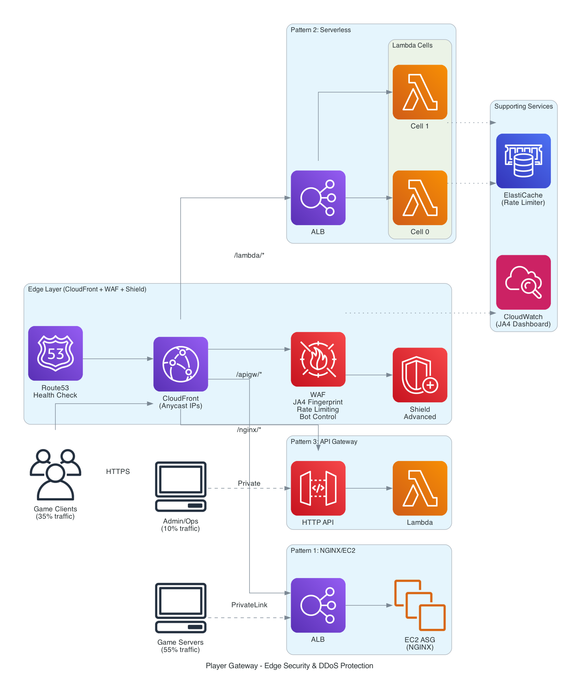

# 🎮 Gateway Revamp — Edge Security & DDoS Protection PoC

> **⚠️ Important:** This is a sample project for demonstration purposes. It should be thoroughly tested, secured, and optimized according to your organization's security standards before deploying to production.

CloudFront + WAF + Shield Advanced in front of NGINX/EC2, with a 3-way architecture comparison.

## What This Is

A CDK-deployed proof-of-concept demonstrating edge security for a gaming studio's player gateway. The PoC adds a managed edge layer (CloudFront, WAF, Shield Advanced) in front of the existing NGINX/EC2 backend without modifying it.



**Three architecture paths deployed behind the same CloudFront distribution:**

| Path | Architecture | Pattern |
|------|-------------|---------|
| `/nginx/*` | CloudFront → ALB → EC2 ASG (NGINX) | Pattern 1: NGINX/EC2 |
| `/lambda/*` | CloudFront → ALB → Lambda (cells) | Pattern 2: Serverless |
| `/apigw/*` | CloudFront → API Gateway → Lambda | Pattern 3: API Gateway |

## Key Features Demonstrated

- **DDoS Protection**: WAF rate limiting scoped by `X-Game-Id` header — blocks attackers without blocking players
- **JA4 TLS Fingerprinting**: Detects botnets sharing the same TLS stack across distributed IPs
- **Reconnection Storm Handling**: 182K+ player reconnections pass through while DDoS is blocked
- **Shield Advanced**: Route53 health checks for proactive DRT engagement
- **Cell-based Architecture**: Blast radius isolation with canary deployments
- **Live Rate-Limit Demo**: Shows blocking in real-time, then proves game clients bypass it

## Quick Start

```bash
# Install
npm install
cd test-client && npm install && cd ..

# Deploy (requires AWS credentials configured)
npx cdk bootstrap   # First time only
npx cdk deploy --all --require-approval never
```

## Running the Demo

```bash
cd test-client

# Get your endpoint from CDK outputs after deployment
ENDPOINT=$(cat ../cdk-outputs.json | python3 -c "import sys,json; print(json.load(sys.stdin)['GamingGateway-Comparison']['ComparisonDistributionDomain'])")

# Full 7-phase demo (reconnection storm + rate-limit trigger + bypass proof)
npx ts-node src/demo-reconnection-storm.ts --endpoint https://$ENDPOINT --peak-rps 100

# 3-way architecture comparison (NGINX vs Lambda vs API GW)
npx ts-node src/comparison-test.ts --endpoint https://$ENDPOINT --rps 15 --duration 30

# Load test
npx ts-node src/load-test.ts --endpoint https://$ENDPOINT --rps 50 --duration 60
```

## Demo Phases

| Phase | Scenario | What it proves |
|-------|----------|----------------|
| 1 | Normal baseline | Steady-state works (35% player, 55% Game Servers, 10% admin) |
| 2 | Server outage | Traffic drop handled |
| 3 | Reconnection storm | 85% player burst passes through WAF |
| 4 | DDoS mixed with storm | Attack traffic blocked, players unaffected |
| 5 | Recovery | System normalizes |
| 6 | **Rate-limit trigger** | 100% non-game traffic → all blocked |
| 7 | **Game client bypass** | Same IP, WITH `X-Game-Id` → 100% passes |

## WAF Rules

| Rule | Threshold | Action | Purpose |
|------|-----------|--------|---------|
| Common Rule Set | — | Block | SQLi, XSS, path traversal |
| Known Bad Inputs | — | Block | Log4j, SSRF |
| Player Reconnection | 50K/5min | Count | Visibility on game client bursts |
| Non-Player Rate Limit | 100/5min* | Block | Blocks traffic without game headers |
| Per-Client Rate Limit | 100K/5min | Block | Global safety net |
| JA4 Fingerprint | 50K/5min | Block | Catches botnets by TLS fingerprint |
| JA4 + IP Combined | 5K/5min | Count | Fine-grained visibility |
| Bot Control | — | Block | Known bot user agents |

*\*Low threshold for demo. Production: 2K-10K depending on traffic patterns.*

## Project Structure

```
├── bin/gaming-gateway.ts              # CDK app entry point
├── lib/
│   ├── stacks/
│   │   ├── network-stack.ts           # VPC, PrivateLink, Route53 Resolver
│   │   ├── gaming-gateway-stack.ts    # Core: CloudFront + WAF + ALB + Lambda + Shield
│   │   ├── observability-stack.ts     # Dashboards, alarms, JA4 metrics
│   │   └── comparison-stack.ts        # 3-way comparison: NGINX vs Lambda vs API GW
│   └── constructs/
│       ├── gateway-cell.ts            # Lambda cell (blast radius isolation)
│       ├── canary-deployment.ts       # CodeDeploy canary with auto-rollback
│       ├── rate-limiter.ts            # ElastiCache Redis rate limiting
│       └── nginx-baseline.ts          # EC2 ASG with NGINX
├── lambda/
│   ├── router/index.js                # Routing logic (handles all 3 paths)
│   └── cell-handler/index.js          # Cell handler with circuit breaker
├── test-client/src/
│   ├── demo-reconnection-storm.ts     # 7-phase demo script
│   ├── comparison-test.ts             # Lambda vs NGINX comparison
│   ├── load-test.ts                   # Load/performance testing
│   ├── smoke-test.ts                  # Post-deployment validation
│   └── sustained-attack-test.ts       # 1-hour mixed traffic for dashboard data
└── docs/demo-presentation.html        # HTML presentation for customer demo
```

## Live URLs

After deployment, get your endpoints from CDK outputs:

```bash
cat cdk-outputs.json | python3 -m json.tool
```

| Resource | Output Key |
|----------|-----------|
| NGINX path | `ComparisonDistributionDomain` + `/nginx/health` |
| Lambda path | `ComparisonDistributionDomain` + `/lambda/health` |
| API GW path | `ComparisonDistributionDomain` + `/apigw/health` |
| Operations Dashboard | `GamingGateway-Observability.DashboardUrl` |
| Comparison Dashboard | `GamingGateway-Comparison.ComparisonDashboardUrl` |

WAF and Shield consoles are accessible from the AWS Console under WAF & Shield (set region to **Global (CloudFront)** for WAF).

## Cost

| Scenario | Monthly |
|----------|---------|
| PoC (no live traffic) | ~$212 |
| PoC + Shield Advanced | ~$3,212 |
| PoC with 1% live traffic (4,750 RPS) | ~$23K (on-demand, needs PPA) |

**Prerequisite for live traffic:** Negotiate CloudFront Private Pricing + WAF volume discounts before scaling.

## Account

- **Region:** us-east-1 (configurable in `bin/gaming-gateway.ts`)
- **Stacks:** GamingGateway-Network, GamingGateway-Core, GamingGateway-Observability, GamingGateway-Comparison

## Security

See [CONTRIBUTING](CONTRIBUTING.md#security-issue-notifications) for more information.

## License

This library is licensed under the MIT-0 License. See the [LICENSE](LICENSE) file.
